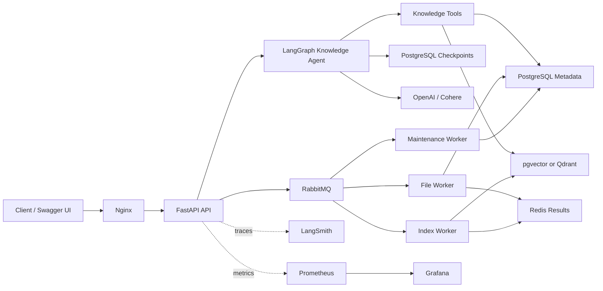
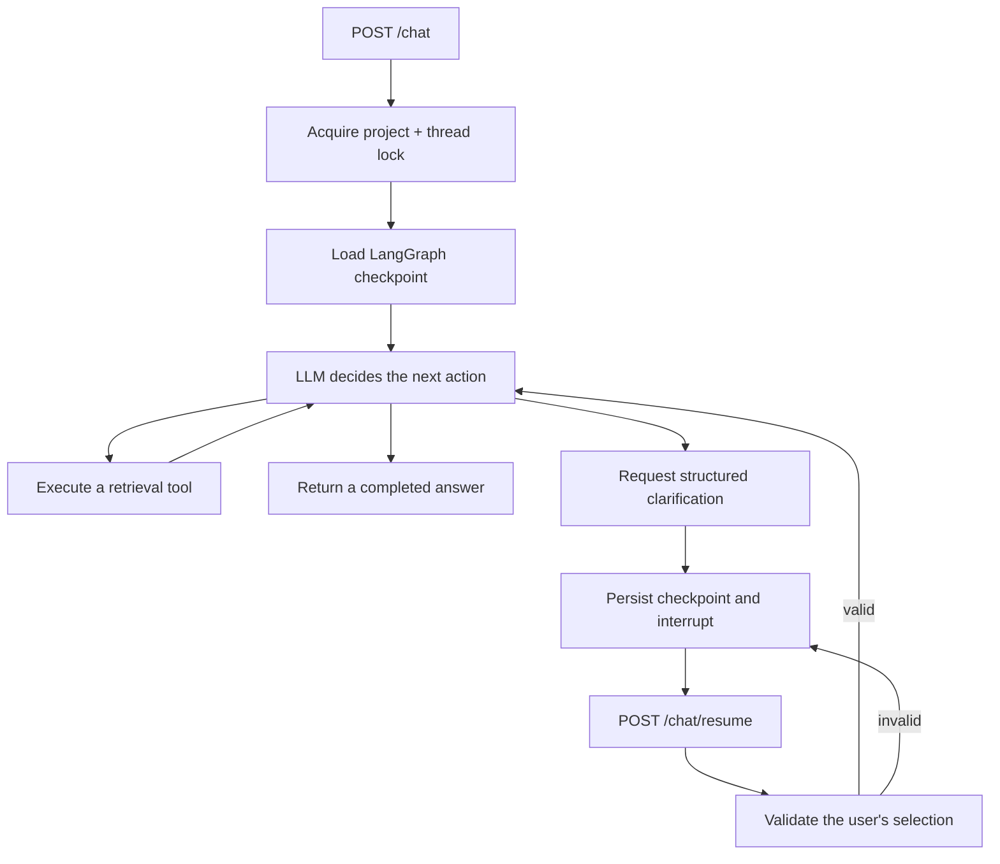

# Mini RAG Knowledge Agent

<p align="center">
  A production-oriented, agentic Retrieval-Augmented Generation backend built with FastAPI, LangGraph, PostgreSQL, Celery, and Docker.
</p>

<p align="center">
  <a href="https://github.com/hebasaadosman/mini-rag-agent/actions/workflows/ci.yml"></a>
  
  
  
  <a href="LICENSE"></a>
</p>

Mini RAG is an API-first knowledge assistant that turns project documents into a searchable knowledge base. It supports asynchronous ingestion, semantic retrieval, tool-using agent workflows, persistent conversation memory, structured Human-in-the-Loop clarification, tracing, metrics, and automated deployment.

The project is designed as a learning-friendly but realistic backend: components are separated by responsibility, long-running work is delegated to queues, agent state survives across requests, and the complete local stack runs with Docker Compose.

> [!IMPORTANT]
> This repository is under active development. API authentication and per-user authorization are not implemented yet. Do not expose the service directly to the public internet without an authenticated gateway, rate limiting, and secure secret management.

## Features

- Upload PDF, TXT, CSV, DOC, and DOCX knowledge sources.
- Process files and build vector indexes asynchronously with Celery.
- Use either PostgreSQL/pgvector or Qdrant as the vector database backend.
- Generate answers with OpenAI- or Cohere-backed providers.
- Orchestrate retrieval tools through a LangGraph knowledge agent.
- Maintain bounded, project-scoped conversation memory using `thread_id`.
- Pause ambiguous requests and resume them through a structured Human-in-the-Loop flow.
- Validate clarification responses against stable asset options before resuming execution.
- Serialize concurrent requests for the same conversation with PostgreSQL advisory locks.
- Trace local and production agent runs in separate LangSmith projects.
- Export application, host, and PostgreSQL metrics to Prometheus and Grafana.
- Monitor background tasks with Flower, RabbitMQ, and Redis.
- Run unit tests, source compilation, Compose validation, and image builds in CI.
- Build and deploy immutable GHCR images from GitHub Actions.

## Architecture



### Knowledge-agent request flow



Conversation memory and Human-in-the-Loop state use the same project-scoped checkpoint. A client must therefore keep the same `project_id` and `thread_id` for the lifetime of a conversation. If a thread is paused, it must be continued through `/chat/resume` before a new `/chat` message can be accepted.

## Technology stack

| Area | Technology |
|---|---|
| API | FastAPI, Uvicorn, Pydantic |
| Agent orchestration | LangGraph, custom tool registry |
| LLM and embeddings | OpenAI, Cohere |
| Relational data | PostgreSQL, SQLAlchemy, Alembic |
| Vector search | pgvector or Qdrant |
| Conversation state | LangGraph PostgreSQL checkpointer |
| Background work | Celery, RabbitMQ, Redis |
| Observability | LangSmith, Prometheus, Grafana, Flower |
| Infrastructure | Docker, Docker Compose, Nginx |
| Automation | GitHub Actions, GHCR |

## Repository structure

```text
mini-rag/
├── .github/workflows/          # CI and production deployment
├── docker/
│   ├── env/                    # Environment templates
│   ├── mini_rag/               # FastAPI image and entrypoint
│   ├── nginx/                  # Reverse-proxy configuration
│   ├── prometheus/             # Metrics scraping configuration
│   ├── docker-compose.yml      # Shared services
│   ├── docker-compose.dev.yml  # Local development overrides
│   └── docker-compose.prod.yml # Production overrides
├── docs/test-data/             # Reproducible end-to-end RAG fixture
├── src/
│   ├── agents/                 # LangGraph agent, nodes, prompts, and tools
│   ├── controllers/            # Application use cases
│   ├── evals/                  # Knowledge-agent evaluation cases and reports
│   ├── models/                 # SQLAlchemy models and migrations
│   ├── observability/          # LangSmith configuration
│   ├── persistence/            # Checkpointing
│   ├── routes/                 # FastAPI routes and request schemas
│   ├── stores/                 # LLM and vector-store providers
│   ├── tasks/                  # Celery tasks
│   ├── utils/                  # Metrics, locking, and idempotency helpers
│   ├── celery_app.py
│   └── main.py
└── tests/                      # Unit and agent behavior tests
```

## Quick start with Docker

### Prerequisites

- Git
- Docker Desktop or Docker Engine with Docker Compose v2
- An API key for the configured generation and embedding providers
- Optional: a LangSmith API key for tracing

### 1. Clone the repository

```bash
git clone https://github.com/hebasaadosman/mini-rag-agent.git
cd mini-rag
```

### 2. Create local environment files

From the repository root:

```bash
cp docker/env/.env.app.example docker/env/.env.app
cp docker/env/.env.postgres.example docker/env/.env.postgres
cp docker/env/.env.grafana.example docker/env/.env.grafana
cp docker/env/.env.postgres-exporter.example docker/env/.env.postgres-exporter
cp docker/env/.env.rabbitmq.example docker/env/.env.rabbitmq
cp docker/env/.env.redis.example docker/env/.env.redis
```

PowerShell equivalent:

```powershell
Copy-Item docker/env/.env.app.example docker/env/.env.app
Copy-Item docker/env/.env.postgres.example docker/env/.env.postgres
Copy-Item docker/env/.env.grafana.example docker/env/.env.grafana
Copy-Item docker/env/.env.postgres-exporter.example docker/env/.env.postgres-exporter
Copy-Item docker/env/.env.rabbitmq.example docker/env/.env.rabbitmq
Copy-Item docker/env/.env.redis.example docker/env/.env.redis
```

Replace every prefilled password and provider key before starting the stack, even if a value already exists in an example file. Keep the PostgreSQL, RabbitMQ, and Redis credentials consistent across the corresponding files. Compose loads `.env.postgres` after `.env.app` for application services, so `.env.postgres` is authoritative for `POSTGRES_USER`, `POSTGRES_PASSWORD`, and `POSTGRES_DB`. Never reuse development credentials in production.

### 3. Configure the application

At minimum, review these values in `docker/env/.env.app`:

```dotenv
APP_ENV=local
GENERATION_BACKEND=OPENAI
EMBEDDING_BACKEND=COHERE
OPENAI_KEY=replace-me
COHERE_API_KEY=replace-me
VECTOR_DB_BACKEND=pgvector
LANGSMITH_TRACING=false
AGENT_MEMORY_MAX_MESSAGES=40
```

The names accepted by the provider factories are defined in `src/stores/llm` and `src/stores/vectordb`. The checked-in example files are the source of truth for all available settings.

### 4. Start the local stack

Validate the resolved Compose configuration first:

```bash
cd docker
docker compose -f docker-compose.yml -f docker-compose.dev.yml config --quiet
```

Build and start every service:

```bash
docker compose -f docker-compose.yml -f docker-compose.dev.yml up -d --build
```

Apply the database migrations after PostgreSQL becomes healthy:

```bash
docker compose \
  -f docker-compose.yml \
  -f docker-compose.dev.yml \
  run --rm --no-deps \
  --workdir /app/models/db_schemes/mini_rag \
  --entrypoint alembic \
  fastapi upgrade head
```

The same migration command on one line works in PowerShell:

```powershell
docker compose -f docker-compose.yml -f docker-compose.dev.yml run --rm --no-deps --workdir /app/models/db_schemes/mini_rag --entrypoint alembic fastapi upgrade head
```

Confirm that the services are running:

```bash
docker compose -f docker-compose.yml -f docker-compose.dev.yml ps
curl http://127.0.0.1:8000/api/v1/health
```

If `curl` is not available in PowerShell, use:

```powershell
Invoke-RestMethod http://127.0.0.1:8000/api/v1/health
```

Expected health response:

```json
{"status":"ok"}
```

### 5. Open the local services

| Service | URL |
|---|---|
| FastAPI | <http://127.0.0.1:8000/api/v1/> |
| Swagger UI | <http://127.0.0.1:8000/docs> |
| OpenAPI JSON | <http://127.0.0.1:8000/openapi.json> |
| API through Nginx | <http://127.0.0.1/api/v1/> |
| Application metrics | <http://127.0.0.1:8000/metrics> |
| Grafana direct | <http://127.0.0.1:3000> |
| Grafana through Nginx | <http://127.0.0.1/grafana/> |
| Prometheus direct | <http://127.0.0.1:9090> |
| Prometheus through Nginx | <http://127.0.0.1/prometheus/> |
| Flower through Nginx | <http://127.0.0.1/flower/> |
| RabbitMQ management | <http://127.0.0.1:15672> |
| Qdrant dashboard | <http://127.0.0.1:6333/dashboard> |
| Node Exporter metrics | <http://127.0.0.1:9100/metrics> |
| PostgreSQL Exporter metrics | <http://127.0.0.1:9187/metrics> |

### 6. Verify a fresh installation

The installation is ready when all of the following succeed:

```bash
docker compose -f docker-compose.yml -f docker-compose.dev.yml ps
docker compose -f docker-compose.yml -f docker-compose.dev.yml logs --tail=100 fastapi
curl http://127.0.0.1:8000/api/v1/health
curl http://127.0.0.1:8000/openapi.json
```

Then open Swagger UI at <http://127.0.0.1:8000/docs>, upload one document, queue the process-and-index workflow, and send a chat request using the examples in the API workflow section below.

## Docker service and port reference

| Compose service | Container | Host port(s) in development | Responsibility |
|---|---|---|---|
| `fastapi` | `mini-rag-app` | `8000` | HTTP API, agent, memory, and metrics |
| `nginx` | `nginx` | `80` | Reverse proxy for the API and dashboards |
| `pgvector` | `pgvector` | `5432` | Relational data, vector data, and agent checkpoints |
| `qdrant` | `qdrant` | `6333`, `6334` | Optional vector database REST and gRPC APIs |
| `rabbitmq` | `rabbitmq` | `5672`, `15672` | Celery broker and management UI |
| `redis` | `redis` | `6379` | Celery result backend |
| `celery-file-worker` | `mini-rag-celery-file-worker` | None | File-processing queue |
| `celery-index-worker` | `mini-rag-celery-index-worker` | None | Index-processing queue |
| `celery-maintenance-worker` | `mini-rag-celery-maintenance-worker` | None | Maintenance queue |
| `celery-beat` | `mini-rag-celery-beat` | None | Scheduled maintenance |
| `flower` | `mini-rag-flower` | Through Nginx | Celery monitoring UI |
| `prometheus` | `prometheus` | `9090` | Metrics storage and queries |
| `grafana` | `grafana` | `3000` | Dashboards |
| `node-exporter` | `node-exporter` | `9100` | Host metrics |
| `postgres-exporter` | `postgres-exporter` | `9187` | PostgreSQL metrics |

## Docker command reference

Run these commands from the `docker` directory. The two Compose files are always specified so the local port mappings and restart policies are applied.

Define a short alias in Bash if desired:

```bash
alias mini-rag-compose='docker compose -f docker-compose.yml -f docker-compose.dev.yml'
```

PowerShell users can define an equivalent function for the current session:

```powershell
function mini-rag-compose { docker compose -f docker-compose.yml -f docker-compose.dev.yml @args }
```

| Action | Command |
|---|---|
| Validate configuration | `mini-rag-compose config --quiet` |
| Build all local images | `mini-rag-compose build` |
| Start all services | `mini-rag-compose up -d` |
| Build and start | `mini-rag-compose up -d --build` |
| Show service state | `mini-rag-compose ps` |
| Show all recent logs | `mini-rag-compose logs --tail=200` |
| Follow all logs | `mini-rag-compose logs -f` |
| Follow API logs | `mini-rag-compose logs -f fastapi` |
| Follow file-worker logs | `mini-rag-compose logs -f celery-file-worker` |
| Follow index-worker logs | `mini-rag-compose logs -f celery-index-worker` |
| Restart the API | `mini-rag-compose restart fastapi` |
| Rebuild only the API | `mini-rag-compose up -d --build fastapi` |
| Open a shell in the API container | `mini-rag-compose exec fastapi bash` |
| Show current migration | `mini-rag-compose exec --workdir /app/models/db_schemes/mini_rag fastapi alembic current` |
| Apply migrations | `mini-rag-compose run --rm --no-deps --workdir /app/models/db_schemes/mini_rag --entrypoint alembic fastapi upgrade head` |
| Stop containers | `mini-rag-compose stop` |
| Stop and remove containers | `mini-rag-compose down` |

> [!CAUTION]
> `mini-rag-compose down -v` also deletes PostgreSQL, Qdrant, Redis, RabbitMQ, Grafana, Prometheus, uploaded-file, and Celery Beat volumes. Use it only when permanent local data loss is intended.

## Configuration reference

The most important application settings are:

| Variable | Purpose |
|---|---|
| `APP_ENV` | Environment name such as `local`, `staging`, or `production` |
| `GENERATION_BACKEND` | Text-generation provider |
| `EMBEDDING_BACKEND` | Embedding provider |
| `GENEERATION_MODEL_ID` | Generation model ID; the spelling matches the current code |
| `EMBEDDING_MODEL_ID` | Embedding model ID |
| `EMBEDDING_MODEL_SIZE` | Embedding vector dimension |
| `VECTOR_DB_BACKEND` | `pgvector` or `qdrant` |
| `POSTGRES_*` | PostgreSQL connection settings |
| `CELERY_BROKER_URL` | RabbitMQ broker URL |
| `CELERY_RESULT_BACKEND` | Redis result-backend URL |
| `LANGSMITH_TRACING` | Enables or disables LangSmith tracing |
| `LANGSMITH_API_KEY` | LangSmith API key |
| `LANGSMITH_PROJECT` | Base tracing project name |
| `AGENT_MEMORY_MAX_MESSAGES` | Maximum recent messages retained in agent context |
| `PRIMARY_LANGUAGE` | Primary prompt language |
| `DEFAULT_LANGUAGE` | Fallback prompt language |

When tracing is enabled, the application derives an environment-aware LangSmith project name from `LANGSMITH_PROJECT` and `APP_ENV`, keeping local and production traces separate.

## API workflow

All endpoints are documented interactively at `/docs`.

### Core endpoints

| Method | Endpoint | Purpose |
|---|---|---|
| `GET` | `/api/v1/` | Application metadata and readiness message |
| `GET` | `/api/v1/health` | Health check |
| `GET` | `/metrics` | Prometheus application metrics |
| `POST` | `/api/v1/data/upload/{project_id}` | Upload a source file |
| `POST` | `/api/v1/data/process/{project_id}` | Queue document processing |
| `POST` | `/api/v1/nlp/index/push/{project_id}` | Queue vector indexing |
| `GET` | `/api/v1/nlp/index/status/{task_id}` | Inspect an indexing task |
| `GET` | `/api/v1/nlp/index/info/{project_id}` | Inspect a project index |
| `POST` | `/api/v1/nlp/index/search/{project_id}` | Run semantic search |
| `POST` | `/api/v1/nlp/index/answer/{project_id}` | Run the direct RAG answer flow |
| `POST` | `/api/v1/workflow/process-and-push/{project_id}` | Chain processing and indexing |
| `POST` | `/api/v1/agents/knowledge/{project_id}/chat` | Chat with the knowledge agent |
| `POST` | `/api/v1/agents/knowledge/{project_id}/chat/resume` | Resume a paused clarification |
| `GET` | `/api/v1/agents/knowledge/{project_id}/memory/{thread_id}` | Inspect thread memory metadata |
| `DELETE` | `/api/v1/agents/knowledge/{project_id}/memory/{thread_id}` | Preview or confirm memory deletion |
| `GET` | `/api/v1/agents/debug/tools/assets/{project_id}` | Development-only asset-tool inspection |
| `GET` | `/api/v1/agents/debug/tools/search/{project_id}` | Development-only search-tool inspection |

Swagger UI is served at `/docs` and the generated OpenAPI schema at `/openapi.json`. The two debug routes are useful during local development but must be disabled or protected in any public deployment.

### End-to-end test document

The repository includes [`docs/test-data/mini_rag_end_to_end_test.pdf`](docs/test-data/mini_rag_end_to_end_test.pdf), a three-page fictional policy and project brief designed for repeatable upload, extraction, indexing, retrieval, grounding, and conversation-memory tests. It contains the unique marker `RAG-QA-ORION-2026` and has no real customer or company data.

Use one `project_id` consistently across upload, processing, indexing, search, and agent calls. Start agent tests with a fresh `thread_id` so an older checkpoint cannot affect the result.

### 1. Upload a document

```bash
curl -X POST \
  "http://127.0.0.1:8000/api/v1/data/upload/1" \
  -H "accept: application/json" \
  -H "Content-Type: multipart/form-data" \
  -F "file=@./docs/test-data/mini_rag_end_to_end_test.pdf"
```

Keep the returned `asset_id` for processing.

### 2. Process and index it

The combined endpoint queues file processing followed by indexing:

```bash
curl -X POST \
  "http://127.0.0.1:8000/api/v1/workflow/process-and-push/1" \
  -H "Content-Type: application/json" \
  -d '{
    "asset_id": 1,
    "chunk_size": 500,
    "overlap_size": 50,
    "do_reset": 0
  }'
```

The response contains a Celery `workflow_id`. Flower and the worker logs can be used to follow background execution.

<details>
<summary><strong>Low-level ingestion, indexing, retrieval, and debug commands</strong></summary>

Use these endpoints when testing individual stages instead of the combined workflow.

Queue file processing only:

```bash
curl -X POST \
  "http://127.0.0.1:8000/api/v1/data/process/1" \
  -H "Content-Type: application/json" \
  -d '{
    "asset_id": 1,
    "chunk_size": 500,
    "overlap_size": 50,
    "do_reset": 0
  }'
```

Queue vector indexing only:

```bash
curl -X POST \
  "http://127.0.0.1:8000/api/v1/nlp/index/push/1" \
  -H "Content-Type: application/json" \
  -d '{"do_reset": 0}'
```

Check a Celery task returned by the indexing endpoint:

```bash
curl "http://127.0.0.1:8000/api/v1/nlp/index/status/REPLACE_WITH_TASK_ID"
```

Inspect the project index:

```bash
curl "http://127.0.0.1:8000/api/v1/nlp/index/info/1"
```

Run semantic search without the agent:

```bash
curl -X POST \
  "http://127.0.0.1:8000/api/v1/nlp/index/search/1" \
  -H "Content-Type: application/json" \
  -d '{"query": "What is the leave policy?", "limit": 5}'
```

Run the direct RAG answer flow without the agent:

```bash
curl -X POST \
  "http://127.0.0.1:8000/api/v1/nlp/index/answer/1" \
  -H "Content-Type: application/json" \
  -d '{"query": "Summarize the leave policy.", "limit": 5}'
```

Inspect the agent's asset-listing tool in development:

```bash
curl "http://127.0.0.1:8000/api/v1/agents/debug/tools/assets/1"
```

Inspect the agent's search tool in development:

```bash
curl "http://127.0.0.1:8000/api/v1/agents/debug/tools/search/1?query=leave&limit=5"
```

</details>

### 3. Chat with the knowledge agent

```bash
curl -X POST \
  "http://127.0.0.1:8000/api/v1/agents/knowledge/1/chat" \
  -H "Content-Type: application/json" \
  -d '{
    "message": "Summarize the uploaded policy.",
    "thread_id": "demo-thread-001"
  }'
```

A completed request returns an answer, source metadata, iteration count, and memory-message count:

```json
{
  "success": true,
  "status": "completed",
  "project_id": 1,
  "answer": "...",
  "iterations": 2,
  "sources": [],
  "clarification": null,
  "interrupt_id": null,
  "memory_message_count": 4,
  "error": null
}
```

Use the same `thread_id` for natural follow-up questions. Use a different `thread_id` to start an isolated conversation.

### 4. Handle an ambiguous request

If the agent cannot safely select a document, it pauses and returns structured clarification:

```json
{
  "success": true,
  "status": "clarification_required",
  "project_id": 1,
  "answer": null,
  "clarification": {
    "type": "clarification",
    "question": "Which report should I summarize?",
    "options": [
      "asset-id_first-report.pdf",
      "asset-id_second-report.pdf"
    ]
  },
  "interrupt_id": "...",
  "error": null
}
```

Resume with the same project and thread. When options are present, send one of the returned values exactly as shown:

```bash
curl -X POST \
  "http://127.0.0.1:8000/api/v1/agents/knowledge/1/chat/resume" \
  -H "Content-Type: application/json" \
  -d '{
    "thread_id": "demo-thread-001",
    "response": "asset-id_first-report.pdf"
  }'
```

An invalid option does not advance or corrupt the checkpoint. The API returns `clarification_required` again with the same pending options. A thread that is waiting for clarification rejects new `/chat` messages until it is resumed.

### 5. Inspect and clear conversation memory

Inspect memory metadata:

```bash
curl "http://127.0.0.1:8000/api/v1/agents/knowledge/1/memory/demo-thread-001"
```

Deletion is intentionally a two-step operation. A request without confirmation only previews the operation and preserves the checkpoint:

```bash
curl -X DELETE \
  "http://127.0.0.1:8000/api/v1/agents/knowledge/1/memory/demo-thread-001"
```

The preview returns `confirmation_required: true`. Permanently clear the thread only after explicit confirmation:

```bash
curl -X DELETE \
  "http://127.0.0.1:8000/api/v1/agents/knowledge/1/memory/demo-thread-001?confirm=true"
```

## Background processing

RabbitMQ is the Celery broker and Redis stores task results. Work is separated into queues so expensive indexing cannot block uploads or maintenance:

| Queue | Worker | Responsibility |
|---|---|---|
| `file_processing` | File worker | Parse files, split content, and persist chunks |
| `index_processing` | Index worker | Generate embeddings and write the vector index |
| `maintenance` | Maintenance worker | Clean up old execution records |

Celery Beat schedules recurring maintenance. Successful execution records are retained for 7 days and failed records for 30 days. The full process-and-push endpoint uses a Celery chain to preserve task order.

## Conversation memory and Human-in-the-Loop

- Memory is short-term conversation state, not a global user profile.
- State is isolated by the combination of `project_id` and `thread_id`.
- The same thread remembers prior user and assistant messages up to `AGENT_MEMORY_MAX_MESSAGES`.
- Human-in-the-Loop interruptions are stored in the same checkpoint as the conversation.
- PostgreSQL advisory locks prevent two API workers from modifying one thread concurrently.
- Memory inspection returns metadata only; it does not expose the full conversation transcript.
- Memory deletion requires `confirm=true` and clears both conversation and pending-interrupt state.

## Evaluation and observability

The repository includes knowledge-agent evaluation cases and scoring logic under `src/evals/knowledge_agent`. Evaluation runs generate ignored JSON reports under `src/evals/knowledge_agent/reports`. The automated test suite covers deterministic control flow, clarification, memory behavior, locking, idempotency, and LangSmith configuration.

Operational visibility is split across:

- **LangSmith** for LLM, tool, and graph traces.
- **Prometheus** for application and infrastructure metrics.
- **Grafana** for dashboards.
- **Flower** for Celery task inspection.
- **RabbitMQ Management** for queues and broker state.

The FastAPI metrics endpoint is available at `/metrics`.

## Testing

### Run tests in the local Python environment

Linux, macOS, or WSL:

```bash
PYTHONPATH=src python -m unittest discover -s tests -v
```

PowerShell:

```powershell
$env:PYTHONPATH = "src"
python -m unittest discover -s tests -v
```

### Run tests in Docker

Build the test image from the repository root:

```bash
docker build -f docker/mini_rag/Dockerfile -t mini-rag:test .
```

Linux, macOS, or WSL:

```bash
docker run --rm \
  --entrypoint python \
  -v "$(pwd):/workspace" \
  -w /workspace \
  -e PYTHONPATH=/workspace/src \
  mini-rag:test \
  -m unittest discover -s tests -v
```

PowerShell uses the backtick as its line-continuation character:

```powershell
docker run --rm `
  --entrypoint python `
  -v "${PWD}:/workspace" `
  -w /workspace `
  -e PYTHONPATH=/workspace/src `
  mini-rag:test `
  -m unittest discover -s tests -v
```

> [!NOTE]
> In Bash or WSL, use `\` for line continuation. The PowerShell backtick syntax does not work in Bash.

The CI workflow runs:

1. Unit tests.
2. Python source compilation.
3. Docker Compose configuration validation.
4. FastAPI image build validation.

## CI/CD

The GitHub Actions workflows are located in `.github/workflows`.

- **CI** runs for pull requests and pushes to `main` or `develop`.
- **Deploy Production** runs by manual dispatch after the required production environment and secrets are configured.
- Production images are tagged with the exact commit SHA and pushed to GHCR.
- Deployment verifies the checked-out commit and resolved Compose image.
- Alembic migrations run in a dedicated one-shot container.
- The deployment performs health checks before cleaning old images.

Production deployment requires a GitHub environment named `production`. Configure these environment secrets before running the deployment workflow:

| Secret | Value |
|---|---|
| `PROD_HOST` | Production server hostname or IP address |
| `PROD_USER` | SSH user on the production server |
| `PROD_PATH` | Absolute repository path on the production server |
| `PROD_SSH_PRIVATE_KEY` | Private SSH key used by GitHub Actions |
| `GHCR_USERNAME` | GitHub Container Registry username |
| `GHCR_READ_TOKEN` | Token with permission to pull the private GHCR image |
| `PROD_ENV_APP` | Complete contents of local `docker/env/.env.app` |
| `PROD_ENV_POSTGRES` | Complete contents of local `docker/env/.env.postgres` |
| `PROD_ENV_GRAFANA` | Complete contents of local `docker/env/.env.grafana` |
| `PROD_ENV_POSTGRES_EXPORTER` | Complete contents of local `docker/env/.env.postgres-exporter` |
| `PROD_ENV_RABBITMQ` | Complete contents of local `docker/env/.env.rabbitmq` |
| `PROD_ENV_REDIS` | Complete contents of local `docker/env/.env.redis` |

The six `PROD_ENV_*` secrets are multiline secrets. Copy the entire corresponding file into each secret value. During deployment, the workflow transfers them as masked Base64 values, recreates the ignored files with mode `600`, synchronizes the existing PostgreSQL role password with `PROD_ENV_POSTGRES`, and only then runs migrations. The raw files and their values are never committed to Git or printed in deployment logs.

## Security notes

- Never commit `.env` files, API keys, database dumps, vector-store data, or runtime scheduler files.
- Use only the `.example` files as committed configuration templates.
- Rotate a credential immediately if it has ever appeared in Git history, logs, screenshots, or an image layer.
- Disable or protect `/api/v1/agents/debug/*` outside trusted development environments.
- Put the API behind authentication, authorization, TLS, and rate limiting before public deployment.
- Treat uploaded documents and model outputs as untrusted input.
- Review Nginx, Grafana, RabbitMQ, Redis, PostgreSQL, and Flower credentials before every deployment.

Please report security issues privately to the repository owner rather than opening a public issue containing sensitive details.

## Roadmap

- Streaming agent responses.
- Semantic caching for repeated questions and approved FAQ answers.
- Summarized and long-term user memory with explicit privacy controls.
- Background evaluation jobs and quality dashboards.
- Multi-agent orchestration for specialized retrieval and review tasks.
- API authentication, project ownership, authorization, and rate limiting.
- Expanded integration, load, failure-recovery, and security tests.

## Contributing

Contributions are welcome. Before opening a pull request:

1. Create a focused feature branch.
2. Keep secrets and runtime data out of the commit.
3. Add or update tests for behavior changes.
4. Run the full test suite locally.
5. Explain the user-visible behavior and migration impact in the pull request.

For larger changes, open an issue first so the design can be discussed before implementation.

## License

Licensed under the [Apache License 2.0](LICENSE).
